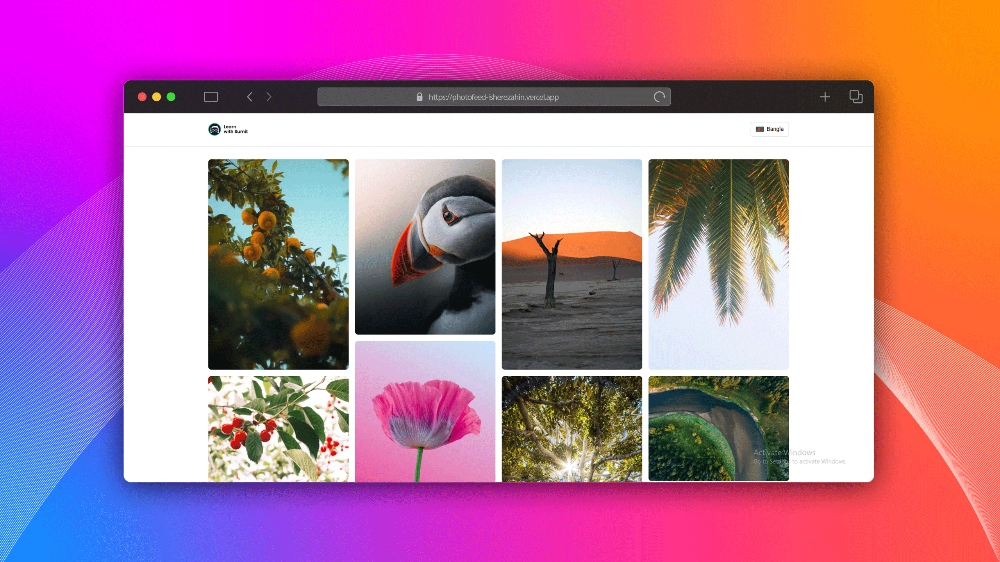

<h2 align="center">PhotoFeed</h2>

A dynamic internationalized photo sharing app built with Next.js App Router for learning purposes.

---

## 📋 About

**PhotoFeed** is a full-featured frontend application created as a part of a learning journey. Built with **Next.js App Router**, it supports both English and Bangla languages, dynamic routing, modals, and responsive design. It consumes data from a backend API and displays user-shared images in a modern UI.

> **Note:** This is a frontend-only project. You will need the backend API running separately to use all features.

---

## ✨ Features

- 🌐 **Language Switcher** – Supports English and Bangla with dynamic routing
- 🖼️ **Image Feed** – View and explore shared images
- 🔍 **Modal Viewer** – Click to view image details in a modal with scroll locking
- ⚡ **Dynamic Routing** – Uses App Router (`/app`) for structured pages
- 📱 **Responsive Design** – Mobile-first layout using Tailwind CSS v4.1
- 🚀 **Optimized for Performance** – Deployed with Vercel and supports image optimization
- 🧭 **404 & Error Pages** – Gracefully handles unknown routes and fetch failures
- 🧠 **Educational Project** – Built with best practices from LWS Reactive Accelerator

---

## 🎓 Learning Project

- **Created by:** Zahin
- **Instructors:** Sumit & Tapas
- **Platform:** Learn with Sumit – Reactive Accelerator Course
- **Goal:** Practice full Next.js App Router features and frontend fundamentals

---